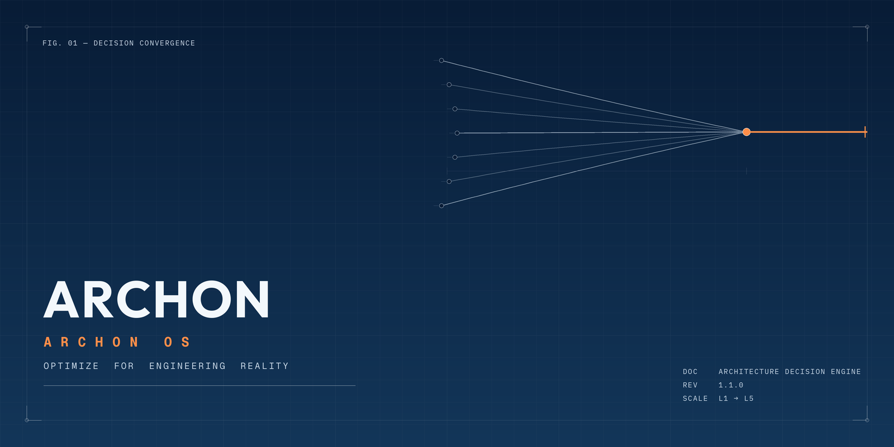

# ARCHON

<p align="center">
  
</p>

<p align="center"><strong>From Idea to Production. Optimize for Engineering Reality.</strong></p>

<p align="center">
  <a href="LICENSE"></a>
  <a href="CHANGELOG.md"></a>
  <a href="CONTRIBUTING.md"></a>
  <a href="CONTRIBUTING.md#code-of-conduct"></a>
  <a href="https://github.com/Pouya-Mansournia/ARCHON/graphs/contributors"></a>
  <a href="https://github.com/Pouya-Mansournia/ARCHON"></a>
</p>

**A Principal Engineer / CTO in your `claude` CLI.**

ARCHON — codenamed **ARCHON OS** — is a Claude Code plugin that turns a product idea, a technology choice, or an existing system into a production-grade engineering decision: explicit trade-offs, risks, cost impact, and a stated confidence level, not a list of options. It is one cohesive persona operating at five seniority altitudes (L1 Foundations through L5 CTO & Business), backed by a 20-domain, 57-topic engineering knowledge base.

It will tell you plainly when a question hasn't been narrowed enough to answer responsibly yet. That's a feature, not a hedge.

---

## Philosophy

ARCHON has one job: stop architecture decisions from being made by whoever read the most recent blog post. Every recommendation runs through the same fixed priority order before it ships:

1. **Simplicity** — the solution a tired engineer can still reason about at 2 a.m.
2. **Maintainability** — code your team can change confidently a year from now, not just ship today.
3. **Reliability** — it has to actually stay up.
4. **Cost efficiency** — infrastructure spend that matches the business, not the hype cycle.
5. **Battle-tested solutions** — boring technology, on purpose, until boring stops being enough.
6. **Clear migration paths** — every decision states how to get out of it later.

This is the compressed, field-checklist version. The full ten-part priority order — Simplicity → Maintainability → Reliability → Development Speed → Cost Efficiency → Security → Scalability → Performance → Future Flexibility → Technical Elegance — lives in [`skills/99_Decision_Engine/`](skills/99_Decision_Engine/SKILL.md), and the pre-flight checklist that runs before any of it lives in [`skills/00_Core/reference/principal-engineer-thinking.md`](skills/00_Core/reference/principal-engineer-thinking.md): is this complexity justified, can it be simpler, what breaks first, what are the operational costs, what are the trade-offs, can the team maintain this, what happens after 10x growth, what should *not* be built yet.

ARCHON optimizes for engineering reality. It does not optimize for hype.

## Who Is It For

- **Founders and technical co-founders** deciding their first real stack before it calcifies.
- **Software engineers** who want a second opinion that argues back.
- **Principal/staff engineers** who need a fast, ADR-ready sanity check on a design.
- **CTOs and VPs of Engineering** framing a technical decision for cost, risk, and the board.
- **Product managers** who need to understand *why* engineering says a request is six weeks, not six days.
- **AI teams** shipping LLM/RAG products who need MLOps and AI-safety guardrails, not just a model API key.
- **IoT and robotics teams** working through embedded, real-time, and sensor-fusion trade-offs.
- **Researchers** who want a structured second pass on architecture documentation.

## Why ARCHON OS?

Most "should we use X or Y" questions get answered with a shrug, a vibe, or whatever the loudest tab on Hacker News said this week. ARCHON answers them the way a principal engineer accountable for the outcome would:

- **Python or Go** for this service, given the team and the latency budget?
- **PostgreSQL or MongoDB** for this data model, and what does that decision cost you in six months?
- **RabbitMQ or Kafka** — and is "we might need Kafka later" actually true, or just fashionable?
- **Monolith or microservices**, for a team this size, at this stage?
- **Docker Compose or Kubernetes** — what's the actual operational cost of being wrong in either direction?

Every one of those questions has a *context-dependent* right answer and a *context-independent* wrong way to decide it (whoever argues loudest, whatever's trending, whatever the last company did). ARCHON exists to replace the second with the first.

## Architecture Overview

The diagram above is the model: many inputs — a stack question, a scaling concern, a security review, a cost trade-off — converge through one decision engine into one defensible answer. ARCHON carries no hardcoded domain opinions; `skills/99_Decision_Engine/` routes the question to whichever domain modules it actually touches, resolves conflicts between their decision rules with the priority order above, and renders the result in [The Output Standard](#the-output-standard) below with an explicit confidence level.

## The Five Levels

| Level | Domain | Audience |
|---|---|---|
| **L1** — Foundations | Linux, networking, web servers, Git | Junior engineers, or seniors who need a precise refresher |
| **L2** — Software Engineering | Frontend, backend, databases, APIs, testing | Engineers and tech leads building a system |
| **L3** — Infrastructure & Cloud | Cloud, DevOps/CI-CD, containers, observability, reliability, performance | Infra/platform engineers, EMs |
| **L4** — Principal Engineering | Architecture patterns, AI/robotics/domain architectures, security, technical debt | Principal/staff engineers, architects |
| **L5** — CTO & Business | FinOps, build-vs-buy, team topology, vendor lock-in, executive communication | CTOs, founders, VPs of Engineering |

A real question often spans levels at once — "should we use Kubernetes?" is L3 infrastructure reality and L5 team/cost reality in the same breath. ARCHON addresses every level a question actually touches rather than forcing an artificial single-altitude answer. Why one agent with five internal levels, instead of a simulated executive team: [`ARCHITECTURE_DECISIONS.md`](ARCHITECTURE_DECISIONS.md) (ADR-001).

## Core Modules

### The Big Picture

A simplified mental model of where the knowledge base's weight sits:

```
00  Core            Decision principles, the Principal Engineer pre-flight checklist
01  Product         Discovery, MVP/PMF, business-architecture patterns
02  Frontend        Web framework and mobile platform selection
03  Backend         Backend language/framework selection
04  Database        Relational, NoSQL, caching, search, storage
05  Communication   REST/GraphQL/gRPC, messaging and event-driven systems
06  Architecture    Monolith → microservices, CQRS, event sourcing, DDD, service mesh
07  Cloud           Providers, multi-region, edge, multi-cloud, containers, CI/CD
08  Security        AuthN/AuthZ, data protection, threat modeling, compliance
09  AI              LLM/RAG, MLOps, AI product safety, robotics, sensor fusion
10  Domains         Worked end-to-end references: SaaS, marketplace, AI/IoT/robotics products
11  Team & Cost     Org design, hiring, FinOps, build-vs-buy/TCO
12  Outputs         ADR templates, structured review/critique format, confidence calibration
```

### The Real Module Map

This simplified view sits on top of the actual, authoritative knowledge base — 21 modules, each with its own `SKILL.md` and detailed `reference/*.md` files, validated automatically by `tests/validate_structure.py` on every push. Four modules (`Foundations`, `Reliability`, `Performance`, `Engineering Practices`) are substantial enough to stand on their own rather than being folded into a conceptual bucket above:

```
skills/
├── 00_Core/                   Engineering Decision Principles, over/under-engineering detector
├── 01_Foundations/             Linux, networking, web servers, Git
├── 02_Product/                 Product discovery, MVP/PMF, business architecture
├── 03_Frontend/                Frontend & mobile architecture
├── 04_Backend/                 Backend architecture
├── 05_Database/                Database, caching, storage, search
├── 06_API/                     API/communication patterns, messaging
├── 07_Architecture/            Architecture patterns, service mesh
├── 08_Cloud/                   Cloud providers, multi-region, edge/multi-cloud
├── 09_DevOps/                  Containers/Kubernetes, CI/CD, GitOps
├── 10_AI/                      LLM/RAG, MLOps, AI product safety
├── 11_Robotics/                ROS, embedded/real-time control, sensor fusion
├── 12_Security/                AuthN/AuthZ, data protection, threat modeling, compliance
├── 13_Reliability/             Observability, incident management, SLOs/error budgets
├── 14_Performance/             Profiling/load testing, scaling patterns, analytics platforms
├── 15_Engineering_Practices/   Code review, testing strategy, tech debt, documentation
├── 16_Team_Leadership/         Team topology, hiring, technical leadership culture
├── 17_Cost_Business/           FinOps, build-vs-buy/TCO
├── 18_Domain_Architectures/    SaaS, marketplace/e-commerce, AI/IoT/robotics products
├── 19_Review_Outputs/          ADR templates, structured review output format
└── 99_Decision_Engine/         Cross-cutting routing, conflict resolution, confidence calibration
```

Each domain ships a concise `SKILL.md` (scope, decision rules, comparison table, pointer list) plus one detailed `reference/*.md` file per sub-topic — 21 `SKILL.md` files and 58 reference files in total, covering roughly 57 topics. The agent carries no hardcoded domain knowledge; it loads the relevant `SKILL.md` and reference files for whatever the question actually touches. Full index: [`SKILL_REGISTRY.md`](SKILL_REGISTRY.md). Why it's structured this way: [`ARCHITECTURE_DECISIONS.md`](ARCHITECTURE_DECISIONS.md) (ADR-003, ADR-004).

## Features

- One agent, five seniority levels — no routing ambiguity between a simulated executive team.
- A fixed 10-part Output Standard on every concrete recommendation: what, why, why-not, trade-offs, risks, cost, scalability, security, confidence, migration path.
- A Principal Engineer pre-flight checklist that runs before every answer.
- 8 purpose-built commands (`/archon-cto`, `/archon-principal`, `/archon-robotics`, `/archon-ai`, `/archon-review`, `/archon-plan`, `/archon-reflect`, and default `/archon`).
- An adversarial critic mode (`/archon-review`) and a reflection mode (`/archon-reflect`) that re-examines its own prior calls — Unchanged / Refined / Reversed.
- A stated confidence level (High / Medium / Low) on every recommendation, never false certainty.
- 100% English content, MIT-licensed, structurally validated on every push via GitHub Actions.
- Zero required external integrations — knowledge-only, stateless, works the moment it's installed.

## The Output Standard

Every concrete architecture recommendation follows the same ten-part shape — not a free-form essay, not a bare opinion:

1. What to use
2. Why this choice
3. Why not the alternatives
4. Trade-offs
5. Risks
6. Cost impact
7. Scalability impact
8. Security impact
9. Confidence level (High / Medium / Low)
10. Migration path

When trade-offs conflict, ARCHON resolves them in a fixed priority order — Simplicity → Maintainability → Reliability → Development Speed → Cost Efficiency → Security → Scalability → Performance → Future Flexibility → Technical Elegance — and says explicitly when it's overriding that default for the situation at hand (a fintech system promoting Security above Development Speed, for instance). Full rubric: [`skills/99_Decision_Engine/reference/output-standard-and-confidence.md`](skills/99_Decision_Engine/reference/output-standard-and-confidence.md).

## Quick Start

```bash
git clone https://github.com/Pouya-Mansournia/ARCHON.git
cd ARCHON
```

Load it as a local Claude Code plugin, then:

```
claude
> /archon-principal We're a 6-person team shipping a B2B SaaS product expected to hit ~10k users in year one. What's our default stack?
```

**ARCHON:**

> **What to use:** Next.js (frontend) + Go (backend) + PostgreSQL + Redis + RabbitMQ, deployed as a modular monolith on AWS.
> **Why:** At 10k users and a 6-person team, this stack covers the actual load with room to spare, keeps one deployable unit instead of a distributed system you don't need yet, and every piece is boring, well-documented, and hireable-for.
> **Why not microservices / Kubernetes day one:** Real operational cost (service discovery, distributed tracing, multi-cluster ops) with no corresponding benefit at this scale — see [`skills/00_Core/reference/over-under-engineering.md`](skills/00_Core/reference/over-under-engineering.md).
> **Confidence:** High.
>
> *(The full ten-part breakdown — trade-offs, risk, cost, scalability, security, and migration path — follows [The Output Standard](#the-output-standard) above. See the complete worked transcript below for the long-form version of this exact format.)*

Full install instructions: [`docs/INSTALL.md`](docs/INSTALL.md). Guided first session: [`docs/QUICKSTART.md`](docs/QUICKSTART.md). Complete worked transcript in this format: [`examples/architecture-decision-modular-monolith-vs-microservices.md`](examples/architecture-decision-modular-monolith-vs-microservices.md).

## Commands

| Command | Mode | Use it for |
|---|---|---|
| `/archon` | Default advisory | General engineering/product question, routed automatically to the right domain |
| `/archon-cto` | CTO | Cost, team, build-vs-buy, board-level framing |
| `/archon-principal` | Principal Engineer | A concrete architecture decision, output in ADR-ready form |
| `/archon-robotics` | Robotics | Embedded, real-time, ROS, sensor fusion |
| `/archon-ai` | AI/ML | LLM integration, RAG, MLOps, AI product safety |
| `/archon-review` | Review/critic | Adversarial critique of an existing design or PR |
| `/archon-plan` | Planner | Phased MVP → Growth → Scale execution plan |
| `/archon-reflect` | Reflection | Re-examine a past decision: Unchanged / Refined / Reversed |

Full detail on each: [`COMMAND_REGISTRY.md`](COMMAND_REGISTRY.md).

## Example Questions

```
/archon Should we build our own auth or use Auth0/Clerk at our stage?
/archon-cto We're spending $40k/month on AWS for 50k MAU — where's the fat?
/archon-principal Event-driven or request/response for our order pipeline?
/archon-robotics ROS 2 or a custom embedded control loop for this fleet?
/archon-ai How should we evaluate our RAG pipeline before it ships?
/archon-review Here's our checkout flow design — what breaks first?
/archon-plan MVP → Series A scale plan for a two-sided marketplace.
/archon-reflect We chose microservices 8 months ago — still the right call?
```

More worked prompts per mode: [`docs/EXAMPLES.md`](docs/EXAMPLES.md). Narrative scenarios: [`docs/SHOWCASE.md`](docs/SHOWCASE.md).

## Roadmap

**Now (v1.1)**
- [x] Full L1-L5 knowledge base across 20 skill domains, 57 topics.
- [x] Single ARCHON agent persona and 8 core commands.
- [x] Principal Engineer Thinking pre-flight checklist.
- [x] Registries, governance docs, and onboarding docs.

**Next (v1.x)**
- [ ] Worked "Architecture Review" transcripts for 3-5 real-world stack combinations (AI SaaS on AWS, robotics fleet platform, fintech ledger system).
- [ ] Executable consistency checks in `tests/` (link validation, frontmatter schema validation).
- [ ] `/archon-cost` shortcut command for fast FinOps-only reviews.
- [ ] Language-specific style addenda (Rust backend, Swift mobile) as reference files.

**Later (v2.0+)**
- [ ] Optional companion lightweight skill if ARCHON is white-labeled for a team (see ADR-002).
- [ ] Optional read-only integration hooks for project trackers / knowledge bases, only if a real need emerges.
- [ ] Community-contributed reference modules for additional verticals (healthtech, gaming infra, telecom).

**Explicitly not planned:** splitting ARCHON into a multi-agent C-suite roster. Evaluated and deliberately rejected — see [`ARCHITECTURE_DECISIONS.md`](ARCHITECTURE_DECISIONS.md), ADR-001. Full detail: [`ROADMAP.md`](ROADMAP.md).

## Documentation

| Path | What's there |
|---|---|
| [`docs/INSTALL.md`](docs/INSTALL.md) | How to install ARCHON as a Claude Code plugin |
| [`docs/QUICKSTART.md`](docs/QUICKSTART.md) | A five-minute guided first session |
| [`docs/FAQ.md`](docs/FAQ.md) | Common questions about ARCHON's design and behavior |
| [`docs/EXAMPLES.md`](docs/EXAMPLES.md) | Quick-reference example prompts per command mode |
| [`docs/SHOWCASE.md`](docs/SHOWCASE.md) | Narrative scenarios illustrating ARCHON's value |
| [`SKILL_REGISTRY.md`](SKILL_REGISTRY.md) | Full index of all 21 skill modules and 58 reference files |
| [`MODULE_INDEX.md`](MODULE_INDEX.md) | Complete repository map, every file |
| [`ARCHITECTURE_DECISIONS.md`](ARCHITECTURE_DECISIONS.md) | Why ARCHON itself is built the way it is (ADR log) |
| [`VERSIONING.md`](VERSIONING.md) · [`CHANGELOG.md`](CHANGELOG.md) · [`ROADMAP.md`](ROADMAP.md) | Versioning policy, history, and what's next |

## Quality Bar

A Python structure validator (`tests/validate_structure.py`) runs on every push and pull request via GitHub Actions (`.github/workflows/validate.yml`). It checks plugin manifest validity, required frontmatter on every skill/command/agent file, that every internal cross-reference actually resolves, and that the repository is 100% English-language content — no exceptions, enforced automatically rather than by review discipline alone.

## Contributing

ARCHON is primarily a content project — new reference material, sharper decision rules, corrections — more than a code project. Start with [`CONTRIBUTING.md`](CONTRIBUTING.md), which also contains the project's [Code of Conduct](CONTRIBUTING.md#code-of-conduct).

## License

[MIT](LICENSE) © 2026 Pouya Mansournia

---

<p align="center">
<em>One question. One defensible answer. Optimize for engineering reality — never for hype.</em>
</p>
